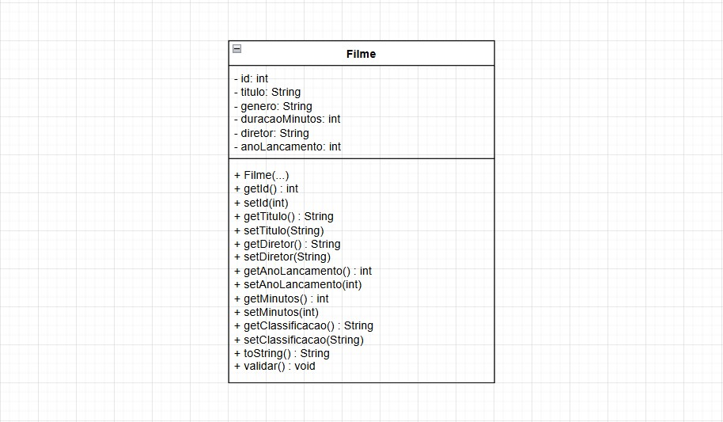

# Sistema de Cadastro de Filmes (Console)

Este é um sistema em Java para gerenciamento de filmes, desenvolvido para a UC **Programação de Soluções Computacionais**. 

O sistema permite realizar operações de **CRUD** (Criar, Listar, Buscar, Editar e Excluir) com persistência de dados em arquivo `.txt`.




### Funcionalidades

- Criar novo filme
- Listar todos os filmes cadastrados
- Buscar filme por ID
- Editar dados de um filme existente
- Excluir um filme
- Persistência dos dados no arquivo `filmes.txt`

### Tecnologias Utilizadas

- **Java (JDK 11 ou superior)**
- Console (linha de comando)
- Persistência em arquivo texto (formato CSV)


### Como Compilar e Executar


**1.** Abra o terminal (Prompt de Comando ou Terminal).

**2.** Navegue até a pasta onde estão os arquivos `.java` (`App.java`, `Filme.java`, `FilmeService.java`).
```
cd caminho/para/seu/projeto
```

**3.** Compile os arquivos com o comando:
``` 
javac App.java Filme.java FilmeService.java 
```

**4.** Após a compilação bem-sucedida, execute o programa.
```
java App
```

O programa abrirá um menu no terminal para você interagir.

### Estrutura do Projeto
```
├── src/
│   ├── App.java
│   ├── Filme.java
│   └── FilmeService.java 
├── lib/
│   └── DiagramadeClasse.jpg 
│
├── filmes.txt        (será criado ao salvar o primeiro filme)
└── README.md 

```

### Regras de Validação
O sistema faz as seguintes validações:

- **Título, gênero e diretor** não podem ser vazios.

- **Ano de lançamento** deve estar entre 1888 e o ano atual.

- **Duração do filme** deve ser maior que 60 minutos.

Se alguma dessas regras for violada, uma mensagem de erro será exibida.


### Persistência

Os dados dos filmes são armazenados em um arquivo chamado **filmes.txt**

Este arquivo é:

- Lido automaticamente ao iniciar o programa.

- Atualizado sempre que um filme é criado, editado ou excluído.

### Contribuição
Este projeto foi desenvolvido por
- Júlia Starling
- João Duarte
- Lucas Santos
